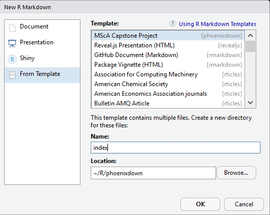

 

# phoenixdown 

This package provides functions for creating Rmarkdown templates to write and manage the Master of Science in Analytics Capstone Project. Templates are formatted according to the current and general requirements of the program.

Currently, the **PDF** and **gitbook** versions are fully-functional. The word and epub versions are in development, have no templates behind them, and are essentially calls to the default functions in bookdown.

If you are new to working with `bookdown` and `rmarkdown`, please read over the documentation available in phoenixdown PDF template (which you can create by following the simple instructions below) and the [bookdown book](https://bookdown.org/yihui/bookdown/).

Under the hood, a custom LaTeX template is used to ensure that documents conform precisely to submission standards. At the same time, composition and formatting can be done using lightweight [markdown](http://rmarkdown.rstudio.com/authoring_basics.html) syntax, and **R** code and its output can be seamlessly included using [rmarkdown](http://rmarkdown.rstudio.com).

## Using phoenixdown to complete your Capstone Project

### Initial setup

Using **phoenixdown** has some prerequisites, such as Pandoc, LaTeX and some fonts. To compile PDF documents using **R**, you need to have Pandoc, LaTeX and several related packages installed. If you have a recent version of  [RStudio](http://www.rstudio.com/products/rstudio/download/), then you already have Pandoc and don't need to do anything more about that. 

Next is LaTeX. By far the easiest way to install LaTeX on any platform is with the [`tinytex`](https://yihui.name/tinytex/) package:

```
install.packages(c('tinytex', 'rmarkdown'))
tinytex::install_tinytex()
# after restarting RStudio, confirm that you have LaTeX with 
tinytex:::is_tinytex()
```

### Starting to write your capstone

To use **phoenixdown** from [RStudio](http://www.rstudio.com/products/rstudio/download/):

1) Ensure that you are using the latest version of [RStudio](http://www.rstudio.com/products/rstudio/download/). You can use phoenixdown without RStudio. For example, you can write the Rmd files in your favorite text editor (e.g. [Atom](https://atom.io/), [Notepad++](https://notepad-plus-plus.org/)). But RStudio is probably the easiest tool for writing both R code and text in your capstone. 

2) Install the **bookdown** and **phoenixdown** packages: 

```
if (!require("devtools")) install.packages("devtools", repos = "http://cran.rstudio.org")

devtools::install_github("rstudio/bookdown")
devtools::install_github("JustinMShea/phoenixdown")
```

3) Use the **New R Markdown** dialog to select **MScA Capstone Project**. Here are the steps, and a screenshot below:

File -> New File -> R Markdown... then choose 'From template', then choose 'MScA Capstone Project.

**VERY IMPORTANT**: You must enter `index` as the **Name**. Your project will only **Knit** if you name the directory `index` at this step. You can name the final .pdf whatever you like later.




Or run this line in your R console to create a new Capstone Project from the template:

```r
rmarkdown::draft(file='index.Rmd', template = "capstone", package = 'phoenixdown', create_dir = TRUE)
```

### Writing your capstone 

You need to edit the individual chapter R Markdown files to write your thesis. 

You can write in the Rmd files without RStudio (in fact RStudio lacks some conveniences for writing, such as live spell-checking and live word count). One may prefer to do some writing and editing of your Rmd files in their favorite text editor. [Atom](https://atom.io/), [Notepad++](https://notepad-plus-plus.org/) and [Emacs](https://www.gnu.org/software/emacs/) are popular choices, ultimately returning to R or RStudio to work on code.


## Rendering

To render your thesis into a PDF, open `index.Rmd` in RStudio and then click the "knit" button. To change the output formats between PDF, gitbook and Word , look at the `output:` field in `index.Rmd`and comment-out the formats you don't want.

Alternatively, if you're not using RStudio, you can use this from the R console, assuming your have set the `'index/` directory as your working directory:

```r
bookdown::render_book('index.Rmd', phoenixdown::capstone_pdf())
```

The PDF file of your thesis will be deposited in the `_book/` directory.


## Components

The following components are ones you should edit to customize your thesis:

### `_bookdown.yml`

This is the main configuration file for your thesis. It determines what Rmd files are included in the output, and in what order. Arrange the order of your chapters in this file and ensure that the names match the names in your folders. 

### `index.Rmd`

This file contains all the meta information that goes at the beginning of your
document. You'll need to edit this to put your name on the first page, the title of your thesis, etc.

### `01-background.Rmd`, `02-methodology.Rmd`, etc.

These are the Rmd files for each section of your capstone, so write each section in these. If you're writing in RStudio, you may find the [wordcount addin](https://github.com/benmarwick/wordcountaddin) useful for getting word counts and readability statistics in R markdown documents. You might also enjoy writing in these Rmd files with [Atom](https://atom.io/), [Notepad++](https://notepad-plus-plus.org/), [Sublime Text](https://www.sublimetext.com/), and [Emacs](https://www.gnu.org/software/emacs/). 

### `bib/`

Store your bibliography (as bibtex files) here. We recommend using the [citr addin](https://github.com/crsh/citr) and [Zotero](https://www.zotero.org/) to efficiently manage and insert citations. 

### `csl/`

Specific style files for bibliographies should be stored here. The default APA style required for the Capstone is already here.

### `figure/` and `data/`

Store your figures and data here and reference them in your R Markdown files. See the [bookdown book](https://bookdown.org/yihui/bookdown/) for details on cross-referencing items using R Markdown.

## Related projects

This project was forked and modifies the code and ideas in the following:

- **https://github.com/benmarwick/huskydown**
- **https://github.com/ismayc/thesisdown**

## Contributing

If you would like to contribute to this project, please start by reading our [Guide to Contributing](CONTRIBUTING.md). Please note that this project is released with a [Contributor Code of Conduct](CONDUCT.md). By participating in this project you agree to abide by its terms.

<!--
To update the PDF template stored in inst/ assuming we are at top level:

rmarkdown::draft('index.Rmd', template = 'capstone', package = 'phoenixdown', create_dir = TRUE, edit = FALSE)

setwd('index')

bookdown::render_book('index.Rmd', phoenixdown::capstone_pdf())

-->

